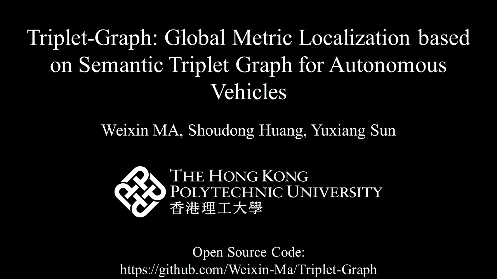
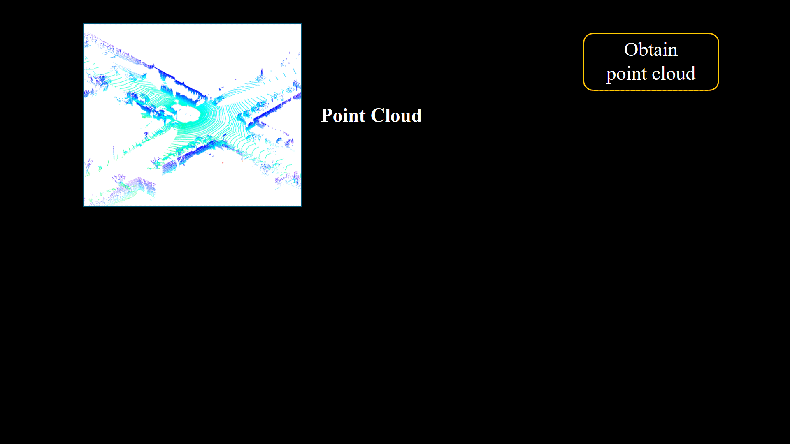
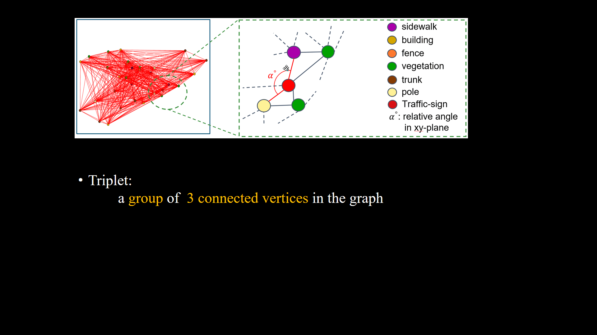

# <p align="center">Triplet-Graph: Global Metric Localization based on Semantic Triplet Graph for Autonomous Vehicles</p>


Triplet-Graph is a key-frame LiDAR based global localization method for simultaneous place similarity measurement and 6-DoF realtive pose estimation. [[paper]](https://ieeexplore.ieee.org/abstract/document/10414178)
<!-- 
Overview of Triplet-Graph.

<p align="center"></p> -->

If you find TripletGraph helpful, please consider citing:
```bibtex
@ARTICLE{ma2024triplet,
  author={Ma, Weixin and Huang, Shoudong and Sun, Yuxiang},
  journal={IEEE Robotics and Automation Letters}, 
  title={Triplet-Graph: Global Metric Localization Based on Semantic Triplet Graph for Autonomous Vehicles}, 
  year={2024},
  volume={9},
  number={4},
  pages={3155-3162}}
```

# Basic elements in Triplet-Graph
## Semantic Graph 
A semantic graph is an abstract representation of an input 3D point cloud. Each vertex in the graph refers to the centroid of an object. Two vertices will be connected when their distance is less than a pre-defined threshold.
<p align="center"></p>

## Triplet
Triplet is the basic element that we use to extract histogram-based descriptor for both individual vertex and the whole graph. A triplet is a group of three connected vertices in the graph. 
<p align="center"></p>

# Install
## Operation system
Tested on Ubuntu 20.04

## Dependencies
* [ROS](https://wiki.ros.org/melodic/Installation/Ubuntu) (for PCL and Eigen)
* [Ceres](http://ceres-solver.org/installation.html)
* yaml-cpp `sudo apt install libyaml-cpp-dev`

## Build
```text
mkdir -p ~/tripletgraph_ws/src
cd ~/tripletgraph_ws/src
git clone https://github.com/Weixin-Ma/Triplet-Graph.git
cd ..
catkin_make
source devel/setup.bash
```
## Data preparation
* **Pair list**
  
We evaluate our method on **SeamnticKitti** dataset following paper SSC: Semantic Scan Context for Large-Scale Place Recognition. You can download `neg_100` [here](https://drive.google.com/file/d/15NdK6gAfmZAi7Gfx2oxaq7pAR7iRwYUc/view?usp=sharing) or you can download all pair lists from the github page for [SSC](https://github.com/lilin-hitcrt/SSC).

* **LiDAR scans**

Please download LiDAR scans from the offical website of [SemanticKitti](http://www.semantic-kitti.org/) dataset. Sequence-00, 02, 05, 06, 07, and 08 are used.

* **Semantic label**
  
We use semantic label from SemanticKitti and RangeNet++. You can download them from [SemanticKitti](http://www.semantic-kitti.org/) and [RangeNet++](https://github.com/PRBonn/lidar-bonnetal).

For your convenience, you can download all required data [here](https://drive.google.com/file/d/1_BmwHdPqelCiq7tuWky8qiTGhJ1i5ER2/view?usp=sharing) (onely seq-06 is provided). Unzip `test_data.zip` to folder `src/Triplet-Graph`.

## Run
We provide three different `launch` files.

*Note that you should replace file paths as yours appropriately in `config.yaml`. 


* `tripletgraph_single_pair.launch` This launch file will only run TripletGraph on a single pair of LiDAR scan for the evaluated sequence with visualization using rviz. Please use the following command:
```text
roslaunch tripletgraph tripletgraph_single_pair.launch
```

* `tripletgraph_part_seq.launch` This launch file will run TripletGraph on part of pairs of LiDAR scans for the evaluated sequence with visualization using rviz. Please use the following command:
```text
roslaunch tripletgraph tripletgraph_part_seq.launch
```

* `tripletgraph_entire_seq.launch` This launch file will run TripletGraph on all pairs of LiDAR scans for the evaluated sequence without visualization(for acceleration). It will take some time to be finished. Once finished, you should be able to find results in `/your path/tripletgraph_ws/src/Triplet-Graph/results/`, including `score.txt`, `rte.txt`, and `rre.txt`. Please use the following command:
```text
roslaunch tripletgraph tripletgraph_entire_seq.launch
```


## Evaluation
Based on results files (or you can download [raw data](https://drive.google.com/file/d/1p4qHxb7Et9dQ9k5rIngomVKqlAmFTogm/view?usp=sharing) for results reported in the paper), you can use `eval.py` to get the final results. Copy `eval.py` into the your result folder, and then run command `python3 eval.py`. `numpy`, `sklearn`, and `matplotlib` are required dependences for `eval.py`.

# Contact
If you have any questions, please contact:
* Weixin Ma [<weixin.ma@connect.polyu.hk>]

# Acknowledgement
Many thanks to following nice open-source projects:  

* [SSC](https://github.com/lilin-hitcrt/SSC) : Pair list, SemanticKitti data loader
* [A-LOAM](https://github.com/wh200720041/floam) : tic_toc.h
* [LeGO-LOAM](https://github.com/RobustFieldAutonomyLab/LeGO-LOAM) : Cere-solver

# Support Material
Here are the support material [docs/appendix.pdf](docs/appendix.pdf), which investigates the influences of some important parameters on Triplet-Graph. 


