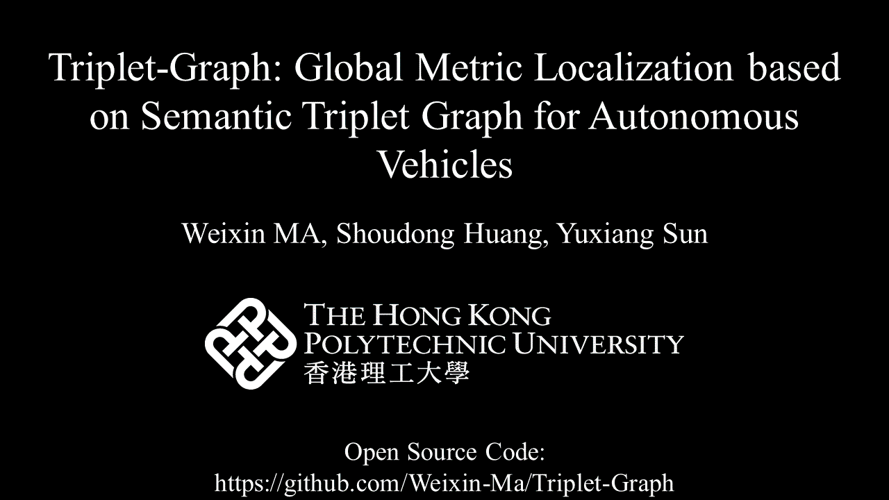
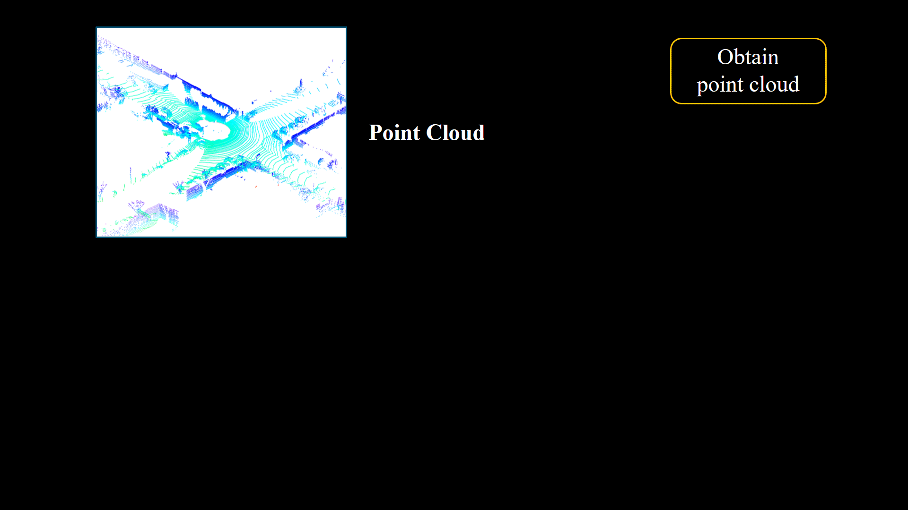
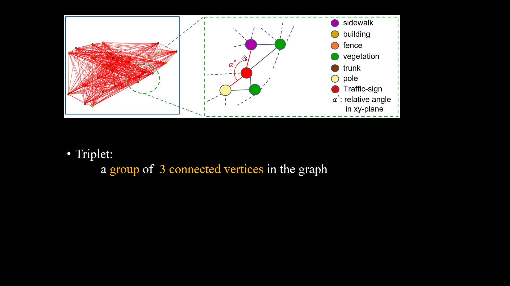
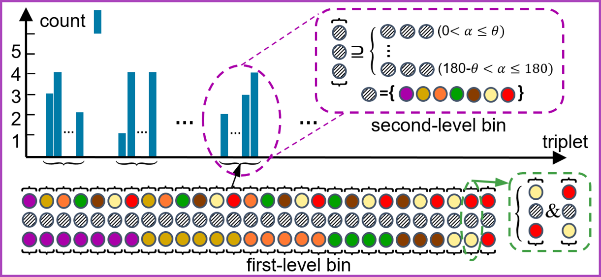

# Triplet-Graph
The official implementation of Triplet-Graph.

The code will be open-sourced upon acceptance of the paper.

# Something about Triplet-Graph
## Semantic Graph 
A semantic graph is an abstract representation of an input 3D point cloud. Each vertex in the graph refers to the centroid of an object. Two vertices will be connected when their distance is less than a pre-defined threshold.

## Triplet
The triplet is the basic element that we use to extract histogram-based descriptor for both individual vertex (local descriptor) and the whole graph (global descriptor). A triplet is a group of three connected vertices in the graph. In a semantic graph, all the triplets that use a certain vertex as the middle vertex are used to extract the local descriptor.

## Local Descriptor

# [Support Material](appendix.pdf)
Here are the support material, which investigates the effects of some important parameters in Triplet-Graph. 
